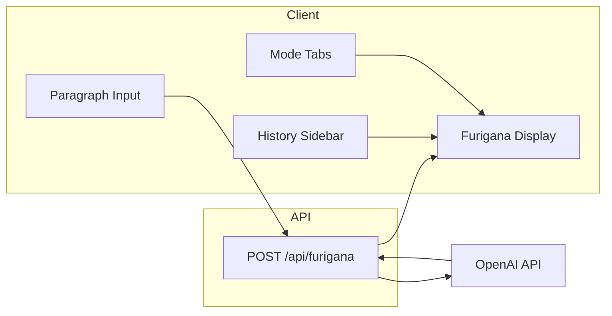

# AI Japanese Reading Assistant – Implementation Plan

## Current state

- **Stack**: Next.js 16 (App Router), React 19, Tailwind v4, TypeScript. Path alias `@/*` → project root.
- **No** shadcn/ui, OpenAI SDK, or API routes yet. [app/page.tsx](app/page.tsx) is the default Next.js starter.

## Architecture overview

- **Data flow (MVP)**: User submits Japanese text → `POST /api/furigana` → OpenAI returns segments → append to history via **history client** (MVP: localStorage) and show in main area. History list is loaded via the same **history client** (MVP: read from localStorage; future: GET `/api/history`). Clicking a history item loads its segments on the right (no new API call).
- **Furigana format**: API returns an array of `{ text: string, reading: string | null }`. Segments with `reading` are kanji/words with furigana; others are plain kana/punctuation. Same data drives both “default” (always show ruby) and “hover” (show reading on hover) modes.

---

## 1. Dependencies and shadcn/ui

- **Install**: `openai` (official SDK), then `npx shadcn@latest init` (use project defaults; ensure Tailwind and path alias match).
- **Add shadcn components**: `Tabs`, `Button`, `ScrollArea`, `Tooltip`, and either `Input` or a styled `<textarea>`. Add `Separator` and `Card` if useful for layout.
- **Optional**: Add a Japanese font in [app/layout.tsx](app/layout.tsx) (e.g. `next/font/google` – Noto Sans JP) and use it for the reading area so kanji/kana render clearly.

**Implementation:**

- **Files**: `package.json` (add `openai`); `components.json` + `lib/utils.ts` + `app/globals.css` (from shadcn init); `components/ui/tabs.tsx`, `components/ui/button.tsx`, `components/ui/scroll-area.tsx`, `components/ui/tooltip.tsx` (and `tooltip-provider.tsx` if required), optionally `components/ui/separator.tsx`, `components/ui/card.tsx`; [app/layout.tsx](app/layout.tsx) (optional: import `Noto_Sans_JP` from `next/font/google` and apply to body or a wrapper).
- **Commands**: `pnpm add openai`; `npx shadcn@latest init`; `npx shadcn@latest add tabs button scroll-area tooltip` (and optionally `separator card`).

---

## 2. Environment and API route

- **Env**: Add `OPENAI_API_KEY` and document it in README or `.env.example` (do not commit the key).
- **Route**: Create [app/api/furigana/route.ts](app/api/furigana/route.ts).
  - Accept `POST` with body `{ text: string }`.
  - Validate `text` (non-empty, reasonable length).
  - Call OpenAI Chat Completions with structured outputs; return `{ segments }` or error.

**Implementation:**

- **Files**: `.env.example` (line: `OPENAI_API_KEY=`); [app/api/furigana/route.ts](app/api/furigana/route.ts).
- **Functions in `app/api/furigana/route.ts**`:
  - `POST(request: NextRequest)`: parse `await request.json()` → `{ text }`; validate `text` (e.g. trim, max length ~10_000); call `openai.chat.completions.create()` with system prompt (segment Japanese into `text`/`reading`, `null` for kana-only), user message = `text`, `response_format` with JSON schema for `{ segments: [{ text, reading }] }`; return `NextResponse.json({ segments })` or `NextResponse.json({ error }, { status: 4xx|5xx })`.
- **Types**: Import or define request body type `{ text: string }` and response type `{ segments: FuriganaSegment[] }`; use [lib/types.ts](lib/types.ts) for `FuriganaSegment`.

---

## 3. Types and shared shape

- **Shared type** in [lib/types.ts](lib/types.ts): `FuriganaSegment = { text: string, reading: string | null }`; `HistoryItem = { id: string, originalText: string, segments: FuriganaSegment[], createdAt: number }`.
- Use these types in the API route, history client, and all components.

**Implementation:**

- **File**: [lib/types.ts](lib/types.ts).
- **Exports**: `export type FuriganaSegment = { text: string; reading: string | null };` and `export type HistoryItem = { id: string; originalText: string; segments: FuriganaSegment[]; createdAt: number };`.

---

## 4. Client state and history (MVP, migration-friendly)

- **State**:
  - Current **mode**: `"default"` | `"hover"` (controlled by shadcn `Tabs`).
  - **History**: array of `{ id: string, originalText: string, segments: FuriganaSegment[], createdAt: number }`.
  - **Selected history id** (or `null`): which item is shown on the right.
  - **Current input** (textarea value) and optional **loading** flag for the submit action.
- **MVP persistence**: History is stored in **localStorage** only; rehydrate on load. No server storage in MVP.
- **Migration-friendly design**:
  - Introduce a **history client** (e.g. `lib/history-client.ts` or a hook) with: `getHistory(): Promise<HistoryItem[]>`, `appendHistoryItem(item)`, optional `deleteHistoryItem(id)`. MVP: read/write localStorage; production: swap to GET `/api/history` and server-side append/delete.
  - The UI **only** uses this client (e.g. via `useHistory` hook), never reads/writes `localStorage` directly, so migrating to server persistence only requires changing the history client implementation.
- Keep segments in each history entry so reopening an item does not call the API again.

**Implementation:**

- **File [lib/history-client.ts**](lib/history-client.ts):
  - `const HISTORY_STORAGE_KEY = 'furigana-history'` (or similar).
  - `async function getHistory(): Promise<HistoryItem[]>` — `localStorage.getItem(HISTORY_STORAGE_KEY)`, `JSON.parse` (or `[]` if null), return.
  - `async function appendHistoryItem(item: HistoryItem): Promise<void>` — `const list = await getHistory()`, push `item`, `localStorage.setItem(HISTORY_STORAGE_KEY, JSON.stringify(list))`.
  - `async function deleteHistoryItem(id: string): Promise<void>` — get list, filter out `id`, write back.
- **File [hooks/useHistory.ts**](hooks/useHistory.ts) (or inline in page): custom hook that on mount calls `getHistory()` and sets state; exposes `history`, `selectedId`, `setSelectedId`, `appendItem(item)`, `deleteItem(id)`, and optionally `loadHistory()` to refetch. All writes go through `appendHistoryItem` / `deleteHistoryItem`; state is updated after write so UI never touches localStorage directly.

---

## 5. Layout and UI structure (shadcn)

- **Layout**: Two main areas side by side (e.g. flex or grid). MVP: sidebar always visible with history loaded via the history client (localStorage).
  - **Left sidebar** (fixed or responsive width):
    - Title/label “History”.
    - shadcn `ScrollArea` containing the list of history entries (e.g. `originalText` truncated, or first line). Each entry is clickable; optionally show a delete icon per item.
    - Use `Button` or list items with clear active state for the selected history entry.
  - **Right area**:
    - **Tabs**: Two tabs — e.g. “Show furigana” (default) and “Hover to see furigana”. Changing tabs only changes how the same segments are rendered; no new API call.
    - **Input**: Textarea for Japanese paragraph + “Get furigana” (or similar) `Button`. On submit: call `POST /api/furigana`, append to history, set as selected, and show result in the display area.
    - **Furigana display**: Renders the selected history item’s segments (or the just-submitted result). If no selection and no result, show placeholder (e.g. “Enter text and submit, or pick from history”).

**Implementation:**

- **File [components/HistorySidebar.tsx**](components/HistorySidebar.tsx) (optional; can be inline in page): component `HistorySidebar({ history, selectedId, onSelect, onDelete })`. Renders heading "History", shadcn `ScrollArea` with list of entries; each entry shows truncated `originalText` (e.g. first 40 chars), is clickable (`onSelect(item.id)`), optionally delete button (`onDelete(item.id)`). Highlight active entry when `item.id === selectedId`.
- **Right area** (in [app/page.tsx](app/page.tsx) or [components/MainPanel.tsx](components/MainPanel.tsx)): shadcn `Tabs` ("Show furigana" / "Hover to see furigana"); `<textarea>` and `Button` "Get furigana" that calls `fetch('/api/furigana', ...)`, then `appendHistoryItem(...)` and sets selected; render `FuriganaDisplay` with `segments` and `mode` from active tab.

---

## 6. Furigana display components

- **Single source of segments**: One component receives `segments: FuriganaSegment[]` and the current **mode** (`"default"` | `"hover"`).
- **Default mode**: For each segment, if `reading != null` render `<ruby>{segment.text}<rt>{segment.reading}</rt></ruby>`, else render `segment.text`. Use appropriate Japanese font and spacing (e.g. `leading-relaxed`, larger base size).
- **Hover mode**: For each segment with `reading != null`, wrap `segment.text` in a shadcn `Tooltip` (or `Popover` with hover) that shows `segment.reading`; do not use `<rt>` so furigana appears only on hover. Segments with `reading == null` stay plain text.
- Ensure the reading area has correct lang attribute (e.g. `lang="ja"`) for accessibility and typography.

**Implementation:**

- **File [components/FuriganaDisplay.tsx**](components/FuriganaDisplay.tsx):
  - Component `FuriganaDisplay({ segments, mode }: { segments: FuriganaSegment[]; mode: 'default' | 'hover' })`.
  - When `mode === 'default'`: map over `segments`; for each segment, if `reading != null` render `<ruby>{segment.text}<rt>{segment.reading}</rt></ruby>`, else `segment.text`. Wrap in a container with `lang="ja"` and appropriate font/size (e.g. `text-lg leading-relaxed`).
  - When `mode === 'hover'`: for segments with `reading != null`, wrap `segment.text` in shadcn `Tooltip` (with `TooltipTrigger` and `TooltipContent` showing `segment.reading`); for `reading == null` render plain text. Same container with `lang="ja"`.
  - When `segments.length === 0`, render placeholder text (e.g. "Enter text and submit, or pick from history").

---

## 7. Page wiring

- **Page**: Replace [app/page.tsx](app/page.tsx) with the main view that composes:
  - Sidebar (history list).
  - Right panel: Tabs (mode), textarea + submit button, and the furigana display component fed by selected history item’s segments (or latest result) and current mode.
- **Metadata**: In [app/layout.tsx](app/layout.tsx), set a meaningful `title` and `description` for the Japanese reading assistant.

**Implementation:**

- **File [app/page.tsx**](app/page.tsx): Default export a client component (e.g. `'use client'` at top). Use `useHistory()` to get `history`, `selectedId`, `setSelectedId`, `appendItem`, `loadHistory` (and optionally `deleteItem`). State: `inputText`, `mode` (from Tabs), `isLoading`, `error` (optional). Layout: flex/grid with `HistorySidebar` on the left and right panel containing `Tabs`, textarea, "Get furigana" button, and `FuriganaDisplay`. On submit: set `isLoading(true)`, `error(null)`; `fetch('/api/furigana')`; on success call `appendItem({ id: crypto.randomUUID(), originalText, segments, createdAt: Date.now() })`, set selected to new id, clear input or keep; on failure set `error(message)`; finally `isLoading(false)`. Display segments from selected history item or from last submit; pass `mode` from active tab to `FuriganaDisplay`.
- **File [app/layout.tsx**](app/layout.tsx): In `metadata` (or exported `metadata`), set `title: 'Japanese Reading Assistant'` (or similar) and `description: '...'`.

---

## 8. Error and loading handling

- **API errors**: Show a simple message (e.g. toast or inline error) when `/api/furigana` fails; do not add segments to history on failure.
- **Loading**: Disable submit button and show a loading state while the request is in flight; optional skeleton in the display area.

**Implementation:**

- **In [app/page.tsx**](app/page.tsx) (or wherever submit lives): Maintain `isLoading: boolean` and `error: string | null`. While `isLoading` is true, set the "Get furigana" button to `disabled` and show a loading label or spinner (e.g. "Loading..."). On `fetch('/api/furigana')` failure, set `error` to the message and render it inline below the button (e.g. `
{error}
`) or use a toast; do not call `appendItem`. Optional: show a skeleton or "Loading..." in the furigana display area when `isLoading` and no previous segments.

---

## Future improvements (MVP to production)

This section organizes the steps to convert the MVP (localStorage history, no auth) into a production app with persisted history and authenticated users. **Choices for production**: **Upstash Redis** for history storage; **Google social login** for user management; when **logged out**, the app remains usable for Japanese input and furigana display only (no history sidebar or saving).

### 1. History persistence (Upstash Redis)

- Add Upstash Redis via Vercel Marketplace; set `KV_REST_API_URL` and `KV_REST_API_TOKEN` in env.
- Implement GET `/api/history` and optional DELETE `/api/history` (or single endpoint with query). Use a **logged-in user ID** (from session, see below) as the Redis key (e.g. `user:{userId}`); value = JSON array of `HistoryItem[]`.
- Update POST `/api/furigana` so that when the user is logged in, the API also appends the new result to that user's history in Redis (or the client calls a separate POST to save after receiving segments).
- In the **history client** (Section 4): replace localStorage read in `getHistory()` with `fetch('/api/history')`; replace localStorage write in `appendHistoryItem()` with the server-side append (or a dedicated POST). Optional: replace localStorage delete with DELETE `/api/history?id=...`.

### 2. User management (Google social login)

- Add an auth provider that supports Google OAuth (e.g. NextAuth.js, Auth.js, or similar). Configure Google OAuth; no email/password sign-up required.
- Protect history: **only when the user is logged in** does the app show the history sidebar, call `getHistory()` from the server, and save new results to history. When **logged out**, the app still allows Japanese input and furigana display (POST `/api/furigana` and show segments), but:
  - Do **not** show the history sidebar (or show it empty with a “Sign in to see history” message).
  - Do **not** persist the current result to history (show furigana for the current input only).
- Use the authenticated user's ID (e.g. `session.user.id`) in API routes as `userId` for Upstash keys instead of an anonymous cookie.

### 3. Logout behavior (no history)

- On logout status: input + “Get furigana” and furigana display remain fully available; history list is hidden or empty; no writes to history. This keeps the app useful for one-off reading without requiring an account.
- Optional: show a small “Sign in with Google to save history” prompt in the sidebar area when logged out.

### 4. Migration order (summary)

1. Add Upstash Redis and implement GET/POST (and optional DELETE) for history keyed by a placeholder `userId` (e.g. from a temporary anonymous cookie) so the history client can be switched to the API without auth yet.
2. Add Google login; require login for history read/write; use `session.user.id` as `userId` in Redis.
3. Enforce “no history when logged out”: hide or empty sidebar, do not append to history when unauthenticated.

---

## File-level summary (MVP)

| File                                                             | Purpose / main exports                                                                                                                                                     |
| ---------------------------------------------------------------- | -------------------------------------------------------------------------------------------------------------------------------------------------------------------------- |
| `.env.example`                                                   | `OPENAI_API_KEY=` (document only).                                                                                                                                         |
| [app/api/furigana/route.ts](app/api/furigana/route.ts)           | `POST(request)` — parse body, validate, call OpenAI with structured output, return `{ segments }` or error.                                                                |
| [lib/types.ts](lib/types.ts)                                     | `FuriganaSegment`, `HistoryItem` types.                                                                                                                                    |
| [lib/history-client.ts](lib/history-client.ts)                   | `getHistory()`, `appendHistoryItem(item)`, `deleteHistoryItem(id)`; MVP: localStorage.                                                                                     |
| [hooks/useHistory.ts](hooks/useHistory.ts)                       | `useHistory()` — returns `history`, `selectedId`, `setSelectedId`, `appendItem`, `deleteItem`, `loadHistory`; calls history client, no direct localStorage in UI.          |
| [components/HistorySidebar.tsx](components/HistorySidebar.tsx)   | `HistorySidebar({ history, selectedId, onSelect, onDelete })` — list of history entries, ScrollArea, highlight selected.                                                   |
| [components/FuriganaDisplay.tsx](components/FuriganaDisplay.tsx) | `FuriganaDisplay({ segments, mode })` — render ruby or Tooltip by mode; `lang="ja"`.                                                                                       |
| [app/page.tsx](app/page.tsx)                                     | Client page: `useHistory()`, `inputText`, `mode`, `isLoading`, `error`; layout Sidebar + Tabs + textarea + button + FuriganaDisplay; submit calls fetch then `appendItem`. |
| [app/layout.tsx](app/layout.tsx)                                 | `metadata` (title, description); optional Japanese font.                                                                                                                   |
| `components/ui/*`, `lib/utils.ts`, `app/globals.css`             | From shadcn init (tabs, button, scroll-area, tooltip, etc.).                                                                                                               |

---

## Clarifications / decisions

- **MVP scope**: This plan implements the MVP only: history in **localStorage**, no auth, no server-side history. The app is built in a **migration-friendly** way (history client abstraction) so that moving to production only requires changing the history client and adding auth + storage (see **Future improvements**).
- **Future production**: **Upstash Redis** for history; **Google social login** for user management; when **logged out**, app still supports input + furigana display but no history (sidebar hidden or empty, no save to history).
- **Rate limits / abuse**: Optional client-side "Submit" cooldown for MVP; optional per-user rate limit in API when moving to production.
- **OpenAI model**: Use a model that supports structured outputs (e.g. `gpt-4o-mini` or `gpt-4o`); specify in the route and document in README.
